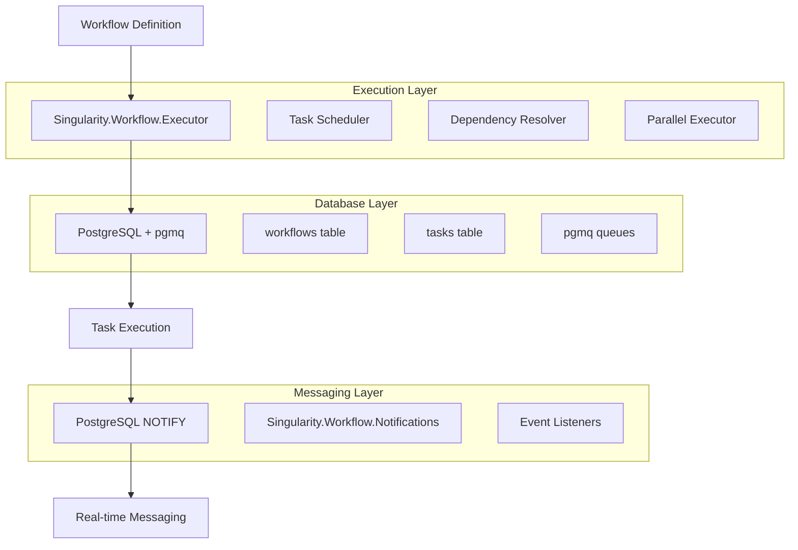

# Singularity.Workflow

[](https://hex.pm/packages/singularity_workflow)
[](https://hex.pm/packages/singularity_workflow)
[](https://travis-ci.org/Singularity-ng/singularity-workflows)
[](https://coveralls.io/github/Singularity-ng/singularity-workflows)

> **📦 This is a library package** - Add it to your Elixir application via Hex.pm as `{:singularity_workflow, "~> 0.1"}`

**Production-ready Elixir library for workflow orchestration with database-driven DAG execution.**

Singularity.Workflow is a **library** that you add to your Elixir applications to provide reliable, scalable workflow execution using PostgreSQL + pgmq extension with real-time messaging via PostgreSQL NOTIFY (NATS replacement).

## What is this?

**This is a library, not a standalone application.** You integrate it into your existing Elixir/Phoenix applications to add workflow orchestration capabilities. Think of it like `Ecto` or `Oban` - a dependency you add to your `mix.exs` to gain powerful workflow features.

## 🚀 Features

- ✅ **Database-Driven DAGs** - Workflows stored and executed via PostgreSQL
- ✅ **Real-time Messaging** - PostgreSQL NOTIFY for instant message delivery (NATS replacement)
- ✅ **Parallel Execution** - Independent branches run concurrently
- ✅ **Multi-Instance Scaling** - Horizontal scaling via pgmq + PostgreSQL
- ✅ **Workflow Lifecycle Management** - Cancel, pause, resume, retry workflows
- ✅ **Phoenix Integration** - Direct LiveView/Channels integration (no Phoenix.PubSub needed)
- ✅ **Comprehensive Logging** - Structured logging for all workflow events
- ✅ **Static & Dynamic Workflows** - Code-based and runtime-generated workflows
- ✅ **Map Steps** - Variable task counts for bulk processing
- ✅ **Dependency Merging** - Steps receive outputs from all dependencies
- ✅ **HTDAG Orchestration** - Goal-driven workflow decomposition (hierarchical task DAGs)
- ✅ **Workflow Optimization** - Learn from execution patterns to optimize future workflows
- ✅ **100% Feature Parity** - Matches workflow orchestration architecture patterns

## 📋 Table of Contents

- [Quick Start](#quick-start)
- [Architecture](#architecture)
- [Real-time Messaging](#real-time-messaging)
- [Workflow Types](#workflow-types)
- [HTDAG Orchestration](#htdag-orchestration)
- [API Reference](#api-reference)
- [Examples](#examples)
- [Testing](#testing)
- [Deployment](#deployment)
- [Contributing](#contributing)

## 🏃‍♂️ Quick Start

### Installation

Add `singularity_workflow` to your application's dependencies in `mix.exs`:

```elixir
def deps do
  [
    {:singularity_workflow, "~> 0.1.0"}
  ]
end
```

Run:
```bash
mix deps.get
```

### Setup Your Application

1. **Install PostgreSQL with pgmq extension:**
```bash
# Install pgmq extension in YOUR database
psql -d your_app_database -c "CREATE EXTENSION IF NOT EXISTS pgmq;"
```

2. **Configure your application's repo:**
```elixir
# config/config.exs
config :my_app, MyApp.Repo,
  database: "my_app_dev",
  username: "postgres",
  password: "postgres",
  hostname: "localhost"

config :my_app,
  ecto_repos: [MyApp.Repo]
```

3. **Start your application:**
```elixir
# lib/my_app/application.ex
def start(_type, _args) do
  children = [
    MyApp.Repo,  # Your repo - Singularity.Workflow uses it
    # ... other children
  ]
  Supervisor.start_link(children, strategy: :one_for_one)
end
```

### Basic Usage

```elixir
# Define a simple workflow
defmodule MyWorkflow do
  def __workflow_steps__ do
    [
      {:step1, &__MODULE__.step1/1, depends_on: []},
      {:step2, &__MODULE__.step2/1, depends_on: [:step1]},
      {:step3, &__MODULE__.step3/1, depends_on: [:step1, :step2]}
    ]
  end

  def step1(input), do: {:ok, %{processed: input.data * 2}}
  def step2(input), do: {:ok, %{validated: input.processed > 0}}
  def step3(input), do: {:ok, %{result: input.validated && input.processed}}
end

# Execute workflow
{:ok, result} = Singularity.Workflow.Executor.execute(MyWorkflow, %{data: 5}, MyApp.Repo)
```

## 🏗️ Architecture



### Core Components

| Component | Purpose | Key Features |
|-----------|---------|--------------|
| **Singularity.Workflow.Executor** | Workflow execution engine | Static/dynamic workflows, parallel execution |
| **Singularity.Workflow.FlowBuilder** | Dynamic workflow creation | Runtime workflow generation, AI/LLM integration |
| **Singularity.Workflow.Notifications** | Real-time messaging | PostgreSQL NOTIFY messaging, structured logging |
| **PostgreSQL + pgmq** | Data persistence & coordination | ACID transactions, message queuing |
| **Task Scheduler** | Dependency resolution | DAG traversal, parallel execution |

## 🔔 Real-time Messaging

Singularity.Workflow provides a complete messaging infrastructure via PostgreSQL NOTIFY (NATS replacement):

### Send Messages

```elixir
# Send workflow event with NOTIFY
{:ok, message_id} = Singularity.Workflow.Notifications.send_with_notify(
  "workflow_events", 
  %{
    type: "task_completed",
    task_id: "task_123",
    workflow_id: "workflow_456",
    status: "success",
    duration_ms: 1500
  }, 
  MyApp.Repo
)
```

### Listen for Messages

```elixir
# Start listening for workflow messages
{:ok, listener_pid} = Singularity.Workflow.Notifications.listen("workflow_events", MyApp.Repo)

# Handle messages
receive do
  {:notification, ^listener_pid, channel, message_id} ->
    Logger.info("Workflow message received: #{channel} -> #{message_id}")
    # Process the message...
after
  5000 -> :timeout
end

# Stop listening
:ok = Singularity.Workflow.Notifications.unlisten(listener_pid, MyApp.Repo)
```

### Notification Types

| Event Type | Description | Payload |
|------------|-------------|---------|
| `workflow_started` | Workflow execution begins | `{workflow_id, input}` |
| `task_started` | Individual task starts | `{task_id, workflow_id, step_name}` |
| `task_completed` | Task finishes successfully | `{task_id, result, duration_ms}` |
| `task_failed` | Task fails with error | `{task_id, error, retry_count}` |
| `workflow_completed` | Entire workflow finishes | `{workflow_id, final_result}` |
| `workflow_failed` | Workflow fails | `{workflow_id, error, failed_task}` |

### Structured Logging

All notifications include comprehensive logging:

```elixir
# Success logging
Logger.info("PGMQ + NOTIFY sent successfully",
  queue: "workflow_events",
  message_id: "msg_123",
  duration_ms: 45,
  message_type: "task_completed"
)

# Error logging
Logger.error("PGMQ + NOTIFY send failed",
  queue: "workflow_events",
  error: "Connection timeout",
  message_type: "workflow_started"
)
```

## 🔄 Workflow Types

### 1. Static Workflows (Recommended)

Define workflows as Elixir modules:

```elixir
defmodule DataProcessingWorkflow do
  def __workflow_steps__ do
    [
      {:fetch_data, &__MODULE__.fetch_data/1, depends_on: []},
      {:validate_data, &__MODULE__.validate_data/1, depends_on: [:fetch_data]},
      {:transform_data, &__MODULE__.transform_data/1, depends_on: [:validate_data]},
      {:save_data, &__MODULE__.save_data/1, depends_on: [:transform_data]}
    ]
  end

  def fetch_data(_input) do
    # Fetch data from API
    {:ok, %{data: [1, 2, 3, 4, 5]}}
  end

  def validate_data(input) do
    # Validate data
    valid = Enum.all?(input.data, &is_number/1)
    {:ok, %{valid: valid, data: input.data}}
  end

  def transform_data(input) do
    # Transform data
    transformed = Enum.map(input.data, &(&1 * 2))
    {:ok, %{transformed: transformed}}
  end

  def save_data(input) do
    # Save to database
    {:ok, %{saved: length(input.transformed)}}
  end
end

# Execute
{:ok, result} = Singularity.Workflow.Executor.execute(DataProcessingWorkflow, %{}, MyApp.Repo)
```

### 2. Dynamic Workflows (AI/LLM Generated)

Create workflows at runtime:

```elixir
# Create workflow
{:ok, workflow_id} = Singularity.Workflow.FlowBuilder.create_flow("ai_generated_workflow", MyApp.Repo)

# Add steps
{:ok, _} = Singularity.Workflow.FlowBuilder.add_step(workflow_id, "analyze", [], MyApp.Repo)
{:ok, _} = Singularity.Workflow.FlowBuilder.add_step(workflow_id, "generate", ["analyze"], MyApp.Repo)
{:ok, _} = Singularity.Workflow.FlowBuilder.add_step(workflow_id, "validate", ["generate"], MyApp.Repo)

# Define step functions
step_functions = %{
  "analyze" => fn input -> {:ok, %{analysis: "complex"}} end,
  "generate" => fn input -> {:ok, %{content: "generated content"}} end,
  "validate" => fn input -> {:ok, %{valid: true}} end
}

# Execute
{:ok, result} = Singularity.Workflow.Executor.execute_dynamic(
  workflow_id, 
  %{prompt: "Generate a report"}, 
  step_functions, 
  MyApp.Repo
)
```

### 3. Map Steps (Bulk Processing)

Process multiple items in parallel:

```elixir
defmodule BulkProcessingWorkflow do
  def __workflow_steps__ do
    [
      {:process_items, &__MODULE__.process_items/1, 
       depends_on: [], 
       initial_tasks: 5}  # Process 5 items in parallel
    ]
  end

  def process_items(input) do
    # This function will be called 5 times in parallel
    item_id = input.item_id
    # Process individual item
    {:ok, %{processed_item: item_id, result: "success"}}
  end
end

# Execute with multiple items
items = Enum.map(1..5, &%{item_id: &1})
{:ok, results} = Singularity.Workflow.Executor.execute(BulkProcessingWorkflow, %{items: items}, MyApp.Repo)
```

## 🎯 HTDAG Orchestration

Singularity.Workflow includes Hierarchical Task DAG (HTDAG) support for **goal-driven workflow decomposition**. Convert high-level goals into executable workflows automatically.

### Quick Example

```elixir
# Define a goal decomposer
defmodule MyApp.GoalDecomposer do
  def decompose("Build authentication system") do
    {:ok, [
      %{id: "design", description: "Design auth flow", depends_on: []},
      %{id: "implement", description: "Implement", depends_on: ["design"]},
      %{id: "test", description: "Test", depends_on: ["implement"]}
    ]}
  end
end

# Define step functions
step_functions = %{
  "design" => &MyApp.Tasks.design_auth/1,
  "implement" => &MyApp.Tasks.implement_auth/1,
  "test" => &MyApp.Tasks.test_auth/1
}

# Execute goal-driven workflow
{:ok, result} = Singularity.Workflow.WorkflowComposer.compose_from_goal(
  "Build authentication system",
  &MyApp.GoalDecomposer.decompose/1,
  step_functions,
  MyApp.Repo,
  optimization_level: :advanced,
  monitoring: true
)
```

### Key Features

- **Automatic Decomposition**: Convert goals to task graphs
- **Optimization**: Learn from execution patterns to optimize future workflows
- **Three Optimization Levels**: `:basic` (safe) → `:advanced` (smart) → `:aggressive` (ML-based)
- **Real-time Monitoring**: Event-driven notifications during execution
- **Multi-Workflow Composition**: Execute multiple goals in parallel

### Components

| Module | Purpose |
|--------|---------|
| `Singularity.Workflow.Orchestrator` | Goal decomposition engine |
| `Singularity.Workflow.WorkflowComposer` | High-level composition API |
| `Singularity.Workflow.OrchestratorOptimizer` | Optimization engine with learning |
| `Singularity.Workflow.OrchestratorNotifications` | Real-time event broadcasting |

For detailed guide, see [HTDAG_ORCHESTRATOR_GUIDE.md](docs/HTDAG_ORCHESTRATOR_GUIDE.md).

## 🔌 Phoenix Integration

Singularity.Workflow integrates directly with Phoenix LiveView and Channels - **no Phoenix.PubSub needed**.

### LiveView Example

```elixir
defmodule MyAppWeb.WorkflowLive do
  use MyAppWeb, :live_view

  def mount(_params, _session, socket) do
    # Listen to workflow events
    {:ok, listener_pid} = Singularity.Workflow.listen("workflow_events", MyApp.Repo)

    {:ok, assign(socket, :listener_pid, listener_pid)}
  end

  def handle_info({:notification, _pid, "workflow_events", message_id}, socket) do
    # Update UI in real-time
    {:noreply, update_workflow_list(socket, message_id)}
  end

  def terminate(_reason, socket) do
    Singularity.Workflow.unlisten(socket.assigns.listener_pid, MyApp.Repo)
    :ok
  end
end
```

### Why Not Phoenix.PubSub?

| Feature | Singularity.Workflow | Phoenix.PubSub |
|---------|----------------------|----------------|
| **Persistence** | PostgreSQL (survives restarts) | Memory only (ephemeral) |
| **Multi-node** | PostgreSQL coordination | Requires node clustering |
| **Message History** | Queryable via pgmq | Not available |
| **Reliability** | ACID guarantees | Best-effort delivery |

For comprehensive Phoenix integration guide, see [API_REFERENCE.md](docs/API_REFERENCE.md#phoenix-integration).

## 📚 API Reference

### Singularity.Workflow.Executor

```elixir
# Execute static workflow
Singularity.Workflow.Executor.execute(workflow_module, input, repo, opts \\ [])

# Execute dynamic workflow
Singularity.Workflow.Executor.execute_dynamic(workflow_id, input, step_functions, repo, opts \\ [])

# Options
opts = [
  timeout: 30_000,           # Execution timeout (ms)
  max_retries: 3,            # Retry failed tasks
  parallel: true,            # Enable parallel execution
  notify_events: true,       # Send NOTIFY events
  execution: :local          # :local (this node) or :distributed (multi-node)
]

# Execution strategies
execution: :local        # Execute locally on this node (default)
execution: :distributed  # Execute across multiple nodes via PostgreSQL + pgmq
```

### Workflow Lifecycle Management

```elixir
# Get workflow status
{:ok, status, metadata} = Singularity.Workflow.get_run_status(run_id, repo)
# Returns: {:ok, :in_progress, %{total_steps: 5, completed_steps: 2}}

# List all workflows
{:ok, runs} = Singularity.Workflow.list_workflow_runs(repo, status: "started")

# Pause running workflow
:ok = Singularity.Workflow.pause_workflow_run(run_id, repo)

# Resume paused workflow
:ok = Singularity.Workflow.resume_workflow_run(run_id, repo)

# Cancel workflow
:ok = Singularity.Workflow.cancel_workflow_run(run_id, repo, reason: "User cancelled")

# Retry failed workflow
{:ok, new_run_id} = Singularity.Workflow.retry_failed_workflow(failed_run_id, repo)
```

### Singularity.Workflow.FlowBuilder

```elixir
# Create workflow
Singularity.Workflow.FlowBuilder.create_flow(name, repo)

# Add step
Singularity.Workflow.FlowBuilder.add_step(workflow_id, step_name, depends_on, repo)

# Add map step
Singularity.Workflow.FlowBuilder.add_map_step(workflow_id, step_name, depends_on, initial_tasks, repo)

# Get workflow
Singularity.Workflow.FlowBuilder.get_workflow(workflow_id, repo)

# List workflows
Singularity.Workflow.FlowBuilder.list_workflows(repo)
```

### Singularity.Workflow.Notifications

```elixir
# Send with NOTIFY
Singularity.Workflow.Notifications.send_with_notify(queue_name, message, repo)

# Listen for events
Singularity.Workflow.Notifications.listen(queue_name, repo)

# Stop listening
Singularity.Workflow.Notifications.unlisten(pid, repo)

# Send NOTIFY only (no persistence)
Singularity.Workflow.Notifications.notify_only(channel, payload, repo)
```

## 🧪 Testing

### Running Tests

```bash
# Run all tests
mix test

# Run with coverage
mix test --cover

# Run specific test file
mix test test/singularity_workflow/executor_test.exs
```

### Test Structure

```
test/
├── singularity_workflow/
│   ├── executor_test.exs           # Workflow execution tests
│   ├── flow_builder_test.exs       # Dynamic workflow tests
│   ├── notifications_test.exs      # NOTIFY functionality tests
│   └── integration_test.exs        # End-to-end tests
├── support/
│   ├── test_repo.ex                # Test database setup
│   └── workflow_helpers.ex         # Test utilities
└── test_helper.exs                 # Test configuration
```

### Example Test

```elixir
defmodule Singularity.Workflow.ExecutorTest do
  use ExUnit.Case, async: true
  alias Singularity.Workflow.Executor

  test "executes simple workflow" do
    defmodule TestWorkflow do
      def __workflow_steps__ do
        [{:step1, &__MODULE__.step1/1, depends_on: []}]
      end
      def step1(input), do: {:ok, %{result: input.value * 2}}
    end

    {:ok, result} = Executor.execute(TestWorkflow, %{value: 5}, TestRepo)
    assert result.step1.result == 10
  end
end
```

## 🚀 Examples

### Complete Examples

Check the `examples/` directory for comprehensive examples:

- **`simple_workflow.ex`** - Basic workflow execution
- **`parallel_processing.ex`** - Map steps and parallel execution
- **`dynamic_workflow.ex`** - Runtime workflow generation
- **`notifications_demo.ex`** - Real-time notification handling
- **`error_handling.ex`** - Retry logic and error recovery

### Integration Examples

- **`phoenix_integration.ex`** - Phoenix LiveView integration
- **`ai_workflow_generation.ex`** - LLM-generated workflows
- **`microservices_coordination.ex`** - Multi-service workflows

## 📦 Deploying Applications That Use This Library

> **Note**: These examples show how to deploy **your application** that uses the Singularity.Workflow library. This library itself doesn't need deployment - you add it as a dependency.

### Production Configuration in Your App

```elixir
# config/prod.exs in YOUR application
config :my_app, MyApp.Repo,
  url: System.get_env("DATABASE_URL"),
  pool_size: String.to_integer(System.get_env("POOL_SIZE") || "10")

# Your application uses Singularity.Workflow as a library
# No special configuration needed - just use your repo
```

### Docker Example (Your Application)

```dockerfile
# Dockerfile for YOUR application
FROM elixir:1.19-alpine

WORKDIR /app
COPY mix.exs mix.lock ./
COPY config config
COPY lib lib
COPY priv priv

# Singularity.Workflow will be fetched as a dependency
RUN mix deps.get && mix compile

CMD ["mix", "phx.server"]
```

### Kubernetes Example (Your Application)

```yaml
# k8s/deployment.yaml for YOUR application
apiVersion: apps/v1
kind: Deployment
metadata:
  name: my-app
spec:
  replicas: 3
  template:
    spec:
      containers:
      - name: my-app
        image: my-app:latest  # Your app, which depends on singularity_workflow
        env:
        - name: DATABASE_URL
          valueFrom:
            secretKeyRef:
              name: my-app-secrets
              key: database-url
```

## 🤝 Contributing

Want to contribute to the Singularity.Workflow **library**? Here's how to set up the development environment:

### Development Setup

```bash
# Clone the library repository
git clone https://github.com/Singularity-ng/singularity-workflows.git
cd singularity-workflows

# Install dependencies
mix deps.get

# Setup test database (for library development/testing)
mix ecto.setup

# Run library tests
mix test
```

### Code Quality

```bash
# Format code
mix format

# Lint code
mix credo

# Type check
mix dialyzer

# Security scan
mix sobelow
```

### Pull Request Process

1. Fork the repository
2. Create feature branch (`git checkout -b feature/amazing-feature`)
3. Commit changes (`git commit -m 'Add amazing feature'`)
4. Push to branch (`git push origin feature/amazing-feature`)
5. Open Pull Request

## 📄 License

This project is licensed under the MIT License - see the [LICENSE.md](LICENSE.md) file for details.

## 🙏 Acknowledgments

- **PostgreSQL** - Robust database foundation
- **pgmq** - Message queuing extension
- **Elixir Community** - Amazing ecosystem
- **Singularity-ng** - Workflow orchestration initiative

## 📞 Support

- **Documentation**: [https://hexdocs.pm/singularity_workflow](https://hexdocs.pm/singularity_workflow)
- **Issues**: [GitHub Issues](https://github.com/Singularity-ng/singularity-workflows/issues)
- **Discussions**: [GitHub Discussions](https://github.com/Singularity-ng/singularity-workflows/discussions)
- **Email**: support@singularity.dev

---

**Made with ❤️ by the Singularity-ng Team**
